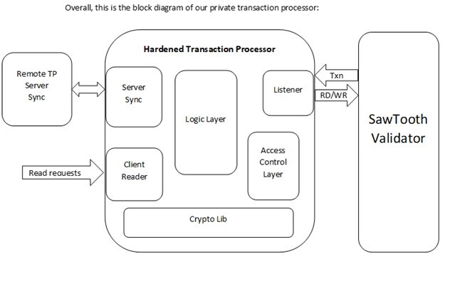

# Private-transaction-families Specification Document

## Introduction

The purpose of this document is to show that by utilizing trusted execution 
environment (TEE) to protect the process of transactions validation, we can 
provide a way to enable distributed ledger to contain private information that 
is both not publicly available but required to validate transactions. 
This solution supports encryption of information in transactions and blocks 
while allowing the ledger to validate the information in those transactions in 
all the nodes and allow them to reach a consensus on the current state of the 
ledger.

In Hyperledger Sawtooth, the transactions are validated by transaction 
processors. Those transaction processors are provided with a general purpose 
data store that allows them to store and retrieve information using addresses. 
Hyperledger Sawtooth manages the context in which transactions are executed 
(new transaction when constructing new blocks, or old transactions when 
validating transactions in blocks sent by other nodes in the system), so the 
transaction processor itself is not aware of the origin of a single transaction 
and reading information stored in a specific address or storing back results 
will be done in the right context. This design maintains these concepts and 
require minimal changes from the actual logic of the transaction processor. 
It is completely generic and can be used as the infrastructure for providing 
privacy for any business logic.

## System Description

The system architecture is based on a generic distributed ledger infrastructure 
(Hyperledger Sawtooth) and an Intel® SGX (Software Guard Extensions) 'hardened'
Transaction Processor.

For more information refer to the relevant documentation on:

[https://sawtooth.hyperledger.org/docs/core/releases/latest/index.html](https://sawtooth.hyperledger.org/docs/core/releases/latest/index.html)

[https://software.intel.com/en-us/sgx](https://software.intel.com/en-us/sgx)

## Intel® SGX

Intel® SGX provides a Trusted Execution Environment (TEE) that enables code and 
data to be measured prior to execution, execute in an isolated environment on 
the same CPU w/o providing the OS, hypervisor or any other software on the 
machine any information on the execution flow, its state or the data it is 
holding (memory is protected and not accessible, debugging capabilities are 
disabled), thus allowing a transaction processor to decrypt and validate 
transaction without exposing any information.

Intel® SGX also provides remote attestation capabilities that allow software to 
verify the identity of Intel® SGX protected software (enclave) that is used to 
establish a secure communication between transaction processors on different 
nodes (making sure we communicate only with identical transaction processors) 
in which we can share secrets.

Another important capability Intel® SGX provides is sealing: enclaves can 
acquire cryptographic keys bound to the platform and the enclave identify to 
locally store confidential information w/o storing the key to this information 
anywhere on the platform. We use this capability to locally store secrets shared 
with other nodes and to allow save and restore of any required state when the 
transaction processor exits and reloaded.

  
## Hardened Transaction Processor overview

Keeping private information in a ledger requires some enhancements in the 
definition of participants. If all the participants are 'equal' then each can 
access, beside what is publicly available to all, only his own private 
information. Once you would like to share information between some members, it 
will require some management mechanism.

We chose this design to support a sharing model, in which there are roles to 
participants. Since we use Intel® SGX to harden the transaction processors, and 
every enclave has a signer, we chose this signer to be the 'administrator' of 
the participant hierarchy. As part of the enclave the signer will provide the 
following information:

1. Initial list of members, each of which is basically a pair of (member ID, 
   public key)
2. Definition of logical groups of members. Each group is identified by a Group 
   ID and contains a list of Member IDs that belong to this group. At least a 
   single group should be set for administrators. This group should contain at 
   least one member. Not setting this properly will prevent extending the 
   addresses used by the transaction processor in Hyperledger Sawtooth Merkel 
   tree: The initial setting for any address is set to the administrators group!
3. List of addresses in Hyperledger Sawtooth store that will be holding public 
   information. All the rest of the addresses are defined as 'private'. A prefix 
   can be used here. All addresses that start with the given prefix will be 
   public. Note that this prefix must not be in any of the next list of 
   addresses.
4. Access control list of private addresses: list of users and groups that can 
   access the information in those addresses. Every entry in the access control 
   list can be an address or a group of addresses (identified by the address 
   prefix).

The above information is either hard coded in the enclave or provided via 
transactions signed by the root authority (the enclave signer). Note that the 
hard coded information is considered public since it is possible to read this 
data from the enclave binary information and there is no secret in it.

Since every transaction processor in a running Hyperledger Sawtooth, system is 
required to be exactly the same for this solution, all the instances are 
initialized with exactly the same members, groups and access control lists. 
However, extending any of those lists has no security limitations, assuming that 
the information available to a new member includes all the previous information 
for addresses he gains access to. A transaction processor can decide to support 
this by allowing transactions for adding members, adding members to groups and 
adding groups or members to the access control list for addresses. Note that it 
is not the case for permission revocation: removing members, removing members 
from groups or removing members or groups from the access control of some 
addresses have security implications and can allow the member that lost access 
to bypass the system security and read information. To prevent this the privacy 
infrastructure does not support such actions on the ACL. When such operations 
are required (due to a loss of the private key of a member or removing a member 
from the system), a new enclave version is required. This enclave will update 
its own SVN and will contain an updated lists for members, groups and access 
control for addresses.

For the information to be private, an end to end protection is required. 
Since only the transaction processor is hardened by Intel® SGX, it is essential 
that no other component in Hyperledger Sawtooth will be allowed access to the 
plain text version of the information. In private ledgers all the information is 
received in the form of transactions. A private transaction processor will 
require additional layer of protection: the payload of the transaction, which on 
standard transaction processors is the plain text version of the transaction 
content, is required to be encrypted. The format and details of this is provided 
in the following sections.

Hyperledger Sawtooth will rout the transaction to the relevant transaction 
processor based on the transaction family. Once the transaction reaches the 
transaction processor, it will be validated again (since the part that did the 
validation in Hyperledger Sawtooth is not hardened by Intel® SGX), decrypted and 
the plain text version parsed and executed. The component that is responsible 
for the first part is called 'transaction listener' and the component that 
parses and executes the transaction is called the 'logic layer'. Both will 
be explained in the next sections.

In this solution, we want to maintain the consensus model: multiple nodes 
execute the same transactions and they should reach an agreement regarding the 
state of the ledger after those transactions are executed. For this to happen 
in the model described above, in which all the transactions content is 
encrypted, we need a safe way to share the key required for decrypting the 
transactions. Every transaction processor enclave that participates in executing 
transactions is unique: it has its digital identity (in Intel® SGX this is the 
measurement of the enclave - the MRENCLAVE), its signer (MRSIGNER represents 
this), its version and other properties. Intel® SGX provides a mechanism in 
which identical transaction processors can identify each other and establish a 
secured channel between them. We utilize this mechanism to privately share the 
keys required to decrypt the transactions. This component is called 
'server sync' and will be described later on.

Last thing required to complete the high level design is a supplement for the 
already existing services that the ledger provides: an access to the data stored 
in its Merkel tree. Hyperledger Sawtooth provides such a service via its 
REST APIs, but using the existing mechanism will not provide the desired 
information: we previously stated that any information outside of the enclave is 
encrypted, and this includes the Hyperledger Sawtooth Merkel tree, so a direct 
access to it will not provide a meaningful information. It will also bypass all 
the privacy mechanism if we provided a public mechanism to do so. We require the 
identity of the requestor for these queries so we can authenticate it, and make 
sure the requestor has an access to the required information. If he has access, 
we then need to encrypt the information in such a way that only the requestor 
will be able to decrypt it. We call this component 'client reader' and it will 
also be described in the next sections

## System Blocks specification

  
### Listener

The transaction listener main role is to receive transactions from Sawtooth and 
return the result of the evaluation of those transactions. The transactions 
listener is split into two parts: the first part is the actual network layer 
that must be in the untrusted side of the process containing the transaction 
processor enclave. This part is responsible of the communication to and from the 
sawtooth validator. On the channel established between them, Sawtooth will send 
transactions and the responses for read and write requests, and the transaction 
listener will send read requests, write requests and the result of executing 
the transaction.

The untrusted side of the transaction listener will rout the transaction to its 
trusted side within the enclave. It must provide the raw data of the 
transaction, including the header, signature and body. Sawtooth require that a 
transaction will be signed with ECDSA using the secp256k1 curve. 
The transaction listener will:

 - Validate the signature of the transaction (process described in Sawtooth 
   documentation)
 - Call the ACL to check the identity of the signer (see the Access Control 
   Layer section)
 - Call the Crypto Lib to decrypt the transaction (see the Crypto Lib section)
 - Call the logic later to validate the transaction
The transaction listener also exposes the following services to the 
Access Control Layer:
 - A read method that will request Sawtooth for the information stored in a 
   given address.
 - A write method that will request Sawtooth to store information in a given 
   address.
 - A method to acquire the identity of the transaction signer. This will be used 
   to apply the rules in the access control settings for any address the 
   transaction will attempt to access.

### Access Control Layer (ACL)

The access control layer holds, initializes and maintains the internal storage 
for the members, groups and access to addresses. It uses those data structures 
to provide two basic APIs which provide the abstraction layer of the privacy to 
the logic layer: Read from address and write to address. It also provide an 
equivalent service to the client reader component.

For the logic layer, both those APIs use the plain text version of the data. 
Everything related to privacy, in the standard execution flow of transaction, 
falls in the hands of the access control layer (put aside custom transactions 
for extending data sets like member, groups etc.)

### Crypto Lib

The crypto Lib provides basic crypto services to the components in the 
Transaction Processor. The library will be suitable for Intel® SGX and protected 
as much as possible from side channel attacks.

The crypto lib should provide an API to set the current KDS and must have an 
access to the transaction processor version. The crypto lib will be able to 
calculate from there all the previous KDSi from the current version to the 
first version.

The crypto lib will derive from the KDSs the required keys for providing the 
services below to the other elements of the transaction processor.

### Server Sync

The server sync is the component responsible for establishing a secure 
connection between identical transaction processors and acquiring the current 
KDS.

Server sync has two sides in this communication protocol: the sender and the 
receiver. The remote attestation process (part of Intel® SGX architecture, not 
detailed here) will ensure that:

 - There is a secure channel between two instances of the transaction processor
 - These transaction processors are exactly the same and running in 
   Intel® SGX mode
 
When the transaction processor can't locate the required cryptographic keys 
locally (this can happen when a new server is added to the network, when a new 
version was deployed or when the locally sealed keys were deleted somehow), it 
will launch the server sync in order to acquire the keys.

The server sync requires a target server address (IP/port pair). This server 
should have an identical transaction processor version that already acquired 
the keys (note that the original keys must be provided to at least one server 
by other means, and that server will be the root of the key distribution 
process. It is possible that all other servers will establish communications 
with that one but it is not a must).

### Client Reader

The client reader provides access to private data for clients. A client read 
request data contains the following:

1. The address of the data
2. A nonce that will be provided as part of the response so the client can be 
   sure the response is genuine and not some replay of an old response

This request will be encrypted with a onetime symmetric key and signed with the 
client private key. The process is described in the threat modelling document.

Upon receiving a read request it will perform the following steps (happy path, 
any failure will result in an empty response):

1. Use the crypto lib API to validate the request
    - Decrypt the signature with the public key from the request
    - Calculate the payload hash and compare to the decrypted signature
    - Compare (a) and (b)
2. Validate the signer and acquire its member ID
    - Check that the public key belongs to a valid member
    - Acquire the member ID from the public key
3. Get the required address and the nonce from the request
4. Call the Access Control Layer Read API with the requestor member ID and 
   requested address. Return value is the plain text version of the data.
5. Call the crypto lib API to form a client response with the data and the 
   nonce. The response will be encrypted with the same key generated by the 
   requestor.
6. Send the read response to the requestor. Once the requestor receives the 
   response he can discard the one time symmetric key generated for this request

### Logic Layer (Transaction logic)

The transaction logic is responsible to implement the business logic and is the 
essence of the transaction processor.

Its main purpose is to approve or reject transactions. It can use the Sawtooth 
Merkel tree to store and retrieve any information that can help speed up the 
process. Since all the information originates from transactions, it should be 
possible to restart from the original settings (genesis) and to parse all the 
transactions up to the current one to decide that. This is extremely inefficient 
and thus the transaction processor design should build and maintain efficient 
data structures to efficiently decide whether transactions are valid or not. In 
order to make sure all the instances of the transaction processors have the same 
data for this decision, the transaction processors store these data structures 
in the Merkel Tree under addresses they wish to use (the number of possible 
addresses is huge). Storing all the information in the Merkel tree allows the 
ledger to reach a consensus regarding the current state of the ledger and allows 
Sawtooth to instantiate more than one transaction processor per node to speed up 
transaction processing by parallelizing the execution of transactions if those 
are not dependent on each other.
